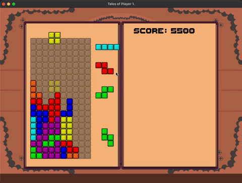
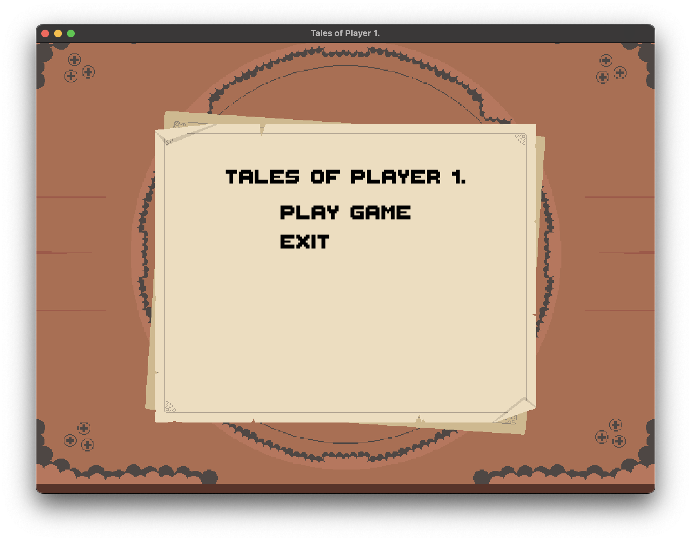
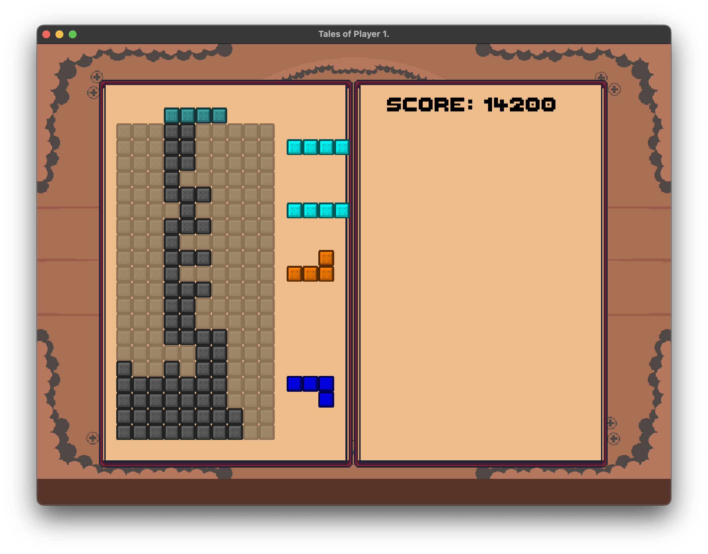

# Tales of Player One.

> A collection of minigames meant to test and improve my game engine.


## Overview

This is just a small project where I try to make various games in the form of minigames to see common features or problems that arises that I could abstract in the form of features for my Game Engine. I am starting this very small right now as I believe that its best to not start hammering features as it would cause unnecessary bloat.

Currently, the Game Engine feels more like a library that wraps SFML. Hopefully as more features gets built on top, it will feel more like an actual engine with GUI capabilities.
## Installation

This project uses CMake, as such upon cloning the project run the following command from the project directory to launch the game.

```bash
  mkdir build
  cd build
  cmake ..
  ./bin/main
```
    
## Creating a new scene / minigame

I try to organize my scenes in the `Scenes` directory and create folders that contains assets for said scenes. In order to create a new scene, simply create a new class which inherits the State class.
```cpp
#include "Engine/GameEngine.hpp"

class SceneName : public State {
    public:
    SceneName(GameDataRef data);
    ~SceneName();
    void Init() override;
    void HandleInput() override;
    void Update(float dt) override;
    void Draw(float dt) override;
    void Pause() override;
    void Resume() override;
}
```
To go to a new scene, you would have to access the StateManager and run the function 
```cpp
this->data->stateMachine.AddState(StateRef(new SceneName(this->data)))
```
## Screenshots






## Acknowledgements
The project and engine relies on SFML a lot to draw windows and handle the game loop. THEY ARE AMAZING.
 - [SFML](https://www.sfml-dev.org/)
 - [Sprites & UI Elements](https://humblepixel.itch.io/pocket-inventory-series-5-player-status/devlog/781331/player-status-v10-inventory-book)
Some resources I found helpful:
 - [Making Tic-Tac-Toe with SFML](https://www.youtube.com/watch?v=JxKyUwpBmy4) (I liked the simplicity of his Engine)
